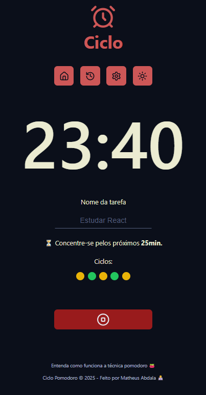

# 🧠 Ciclo Pomodoro

Um aplicativo moderno de técnica Pomodoro com histórico, configurações
personalizáveis, e interface responsiva. Desenvolvido em React, este projeto
busca promover produtividade com uma experiência fluida, leve e intuitiva.

## 🚀 Demonstração

> _([(https://ciclo-pomodoro.vercel.app/])_



---

## 🛠️ Tecnologias Utilizadas

- **React 18 + TypeScript** — para componentes reutilizáveis e tipagem segura
- **Vite** — para build e desenvolvimento ultrarrápidos
- **Context API + Reducer** — gerenciamento global de ciclos e configurações
- **Web Workers** — controle preciso do timer mesmo com abas em segundo plano
- **LocalStorage** — persistência de dados de forma simples e eficaz
- **CSS Modules** — estilização escopada por componente
- **Lucide Icons** — ícones modernos e leves
- **React Toastify** — mensagens de feedback ao usuário

---

## ⚙️ Funcionalidades

- ⏱️ **Timer Pomodoro com ciclos configuráveis** (foco, pausa curta, pausa
  longa)
- 🔁 **Histórico de ciclos** com data e status (concluído, interrompido, em
  andamento)
- 🎛️ **Configurações personalizadas** de tempo de duração de cada ciclo
- 🔊 **Alertas sonoros** ao fim de cada ciclo
- 🌙 **Alternância de tema claro/escuro**
- 💾 **Persistência via localStorage**

---

## 🧩 Estrutura de Pastas

````bash
src/
├── components/       # Componentes reutilizáveis (UI, layouts, botões, inputs)
├── contexts/         # Context API para controle global dos ciclos
├── models/           # Tipagens e modelos de dados
├── pages/            # Páginas principais (Home, Histórico, Configurações)
├── templates/        # Estrutura de layout padrão
├── utils/            # Funções auxiliares e formatadores
├── workers/          # Web Worker para controle de tempo
├── styles/           # Estilos globais e temas
└── assets/           # Imagens e áudios

## 📦 Como rodar o projeto localmente

1. Clone o repositório:

```bash
git clone https://github.com/matheusabdala/ciclo-pomodoro.git
cd ciclo-pomodoro


2. Instale as dependências:

```bash
npm install

3. Rode o servidor de desenvolvimento:

```bash
npm run dev

Abra no navegador: http://localhost:5173
````
